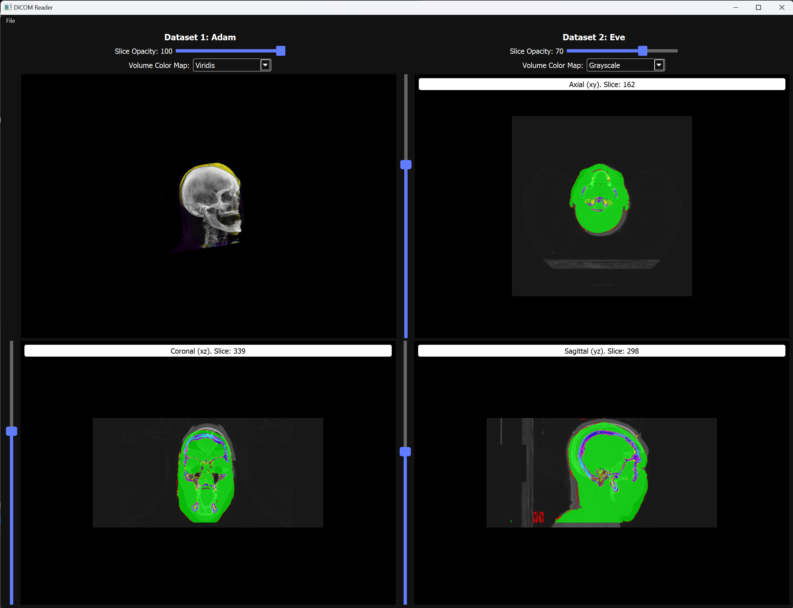

Author: Musab Shakeel
Date: 5/2022

This (header) file contains bulk of the code for a Qt application - a 
general purpose DICOM reader. The VTK library is used to implement
the visualization in this application. 

Notable features:
- Ability to load and view two separate DICOM datasets. The user is able to 
choose a directory for each dataset.
- The second dataset overlays on top of the first dataset.
- For each dataset, the axial/coronal/sagittal slices are shown in 3 separate 
viewports. 
- The volume rendering is also visualized in a separate viewport.
- User is able to change the opacity of the slice renderings.
- User is able to change the colormap for the volume renderings.
- The patient name (pulled from the DICOM data) is displayed for each dataset.

Pressing improvements/TODOs:
- Add ability to change window/level for the slice views.
- Add ability to specify custom color maps (for volume and slice views).
- Add ability to translate/move one DICOM dataset in a viewport (for some datasets, 
it becomes difficult to observe differences when both datasets are overlaid *exactly*
on top of each other).

Expected behavior:
- Dataset 1 and dataset 2 are loaded once, in whatever order. If dataset 1 is uploaded 
multiple times, behavior is undefined.
- The application is robust enough to never crash even with unexpected usage.

